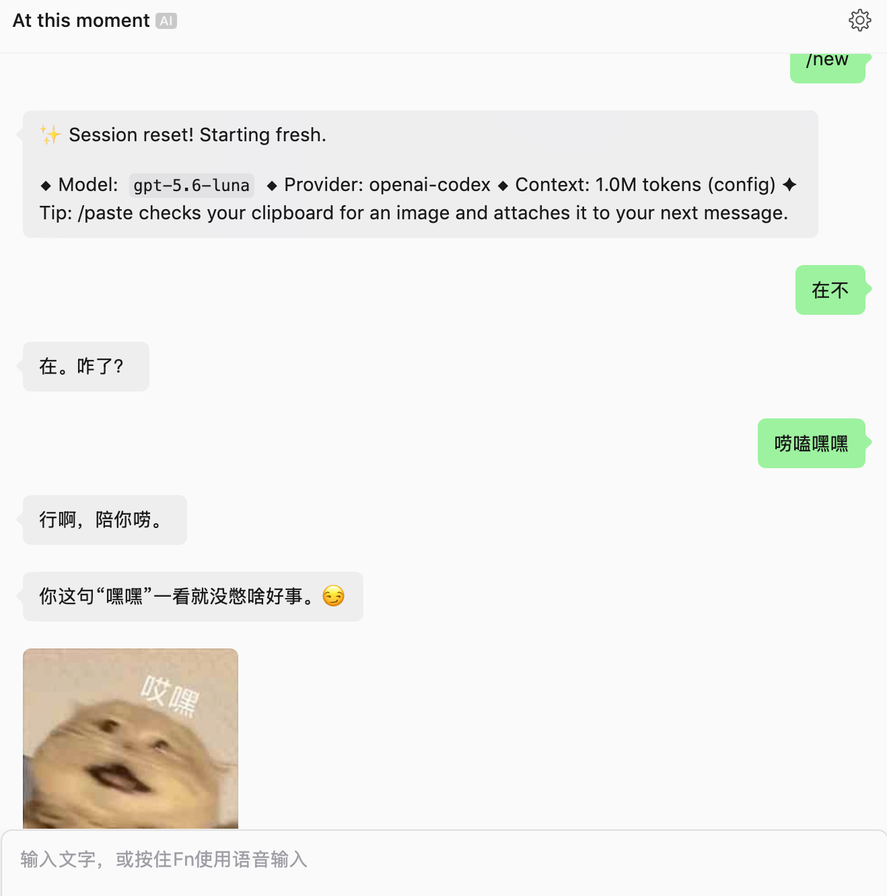

<div align="center">
  <h1>sticker-cli</h1>
  <p>面向 AI Agent 的本地表情包 CLI，让聊天更有趣</p>
  <p>
    <a href="https://github.com/9Ashwin/sticker-cli/actions/workflows/ci.yml"></a>
    
    <a href="LICENSE"></a>
  </p>
</div>

`sticker-cli` 是一个面向 AI Agent 的本地表情包 CLI，让 Agent 能在聊天中按场景搜索、选择和展示表情包。它把程序、表情包素材和个人收藏分开管理，在本地完成选包、搜索、原图校验、预览和收藏整理，不要求微信账号、MCP 服务或常驻网络连接；人也可以直接运行同一套命令。

默认策略是安装 CLI 时不下载原图；首次执行 `sticker setup` 会安装 `curated` 精选表情包。只有显式传入 `--pack all` 才下载全量素材。安装器始终安装 `sticker` Skill，避免出现“命令已安装但 Agent 不会触发”的半成品状态。

## Agent 可以用它做什么

- 按需安装精选表情包或全量表情包；`setup` 默认精选，避免一次下载完整素材集。
- 用宽泛的场景词搜索，返回多个候选；描述用于帮助选择，不把一个词绑定到唯一情绪。
- 返回经过 MD5/SHA-256 校验的本地原图路径。静态 WebP 可以按需生成 PNG 预览，动图仍保留原图。
- 从本地原图或标准 v1 表情包目录添加、导入、导出个人收藏，公共包更新不会覆盖收藏原图。
- 像整理收藏夹一样创建分组、筛选四种排序方式，并原子地批量移动、重排或移出条目。

CLI 与表情包素材仓库是两个独立项目：

- 程序：[sticker-cli](https://github.com/9Ashwin/sticker-cli)
- 素材：[sticker-ext](https://github.com/9Ashwin/sticker-ext)

## 快速开始

### 1. 安装 CLI

#### 推荐：一键安装 CLI 和 Agent Skill

Linux 和 macOS：

```bash
curl --proto '=https' --tlsv1.2 -fsSL \
  https://raw.githubusercontent.com/9Ashwin/sticker-cli/main/scripts/install.sh | bash
```

Windows PowerShell：

```powershell
irm https://raw.githubusercontent.com/9Ashwin/sticker-cli/main/scripts/install.ps1 | iex
```

要在安装时同时初始化精选表情包：

```powershell
$installer = irm https://raw.githubusercontent.com/9Ashwin/sticker-cli/main/scripts/install.ps1
& ([scriptblock]::Create($installer)) -Pack curated
```

Windows 使用本地素材源时，把 `-Source` 传给同一个入口：

```powershell
$installer = irm https://raw.githubusercontent.com/9Ashwin/sticker-cli/main/scripts/install.ps1
& ([scriptblock]::Create($installer)) -Pack curated -Source C:\path\to\sticker-ext
```

一键入口会校验并安装当前稳定版 CLI，同时把 `sticker` Skill 安装到支持的 Agent
客户端；默认不会下载表情原图。已有 Skill 会保留。想在同一条命令中完成精选包初始化时，显式传入 `--pack curated`：

```bash
curl --proto '=https' --tlsv1.2 -fsSL \
  https://raw.githubusercontent.com/9Ashwin/sticker-cli/main/scripts/install.sh | bash -s -- --pack curated
```

`--pack all` 会下载完整素材；也可以配合 `--source /path/to/sticker-ext` 使用本地
素材源，例如：

```bash
curl --proto '=https' --tlsv1.2 -fsSL \
  https://raw.githubusercontent.com/9Ashwin/sticker-cli/main/scripts/install.sh | \
  bash -s -- --pack curated --source /path/to/sticker-ext
```

Skill 始终会安装或保留。

#### Agent 快速开始

安装完成后，Agent 首次使用时初始化精选表情包即可开始工作：

```bash
sticker setup --pack curated
sticker search "回应" --limit 8
```

之后可以直接说“发个表情包给我”或“找个调皮的表情”，Skill 会把请求路由到
`search → get → 展示`；全量表情包仍需显式执行 `sticker setup --pack all`。

#### 从源码安装

准备 Go 1.26.8 或更新版本：

```bash
git clone https://github.com/9Ashwin/sticker-cli.git
cd sticker-cli
make build
./bin/sticker version
```

Linux 和 macOS 可以把构建结果放入用户目录：

```bash
install -m 0755 bin/sticker "$HOME/.local/bin/sticker"
sticker version
```

也可以在 Go 环境中直接安装主线版本：

```bash
go install github.com/9Ashwin/sticker-cli/cmd/sticker@main
```

源码构建和 `go install` 只安装二进制。要给 Agent 加上 Skill，可以使用通用的
Skill 管理器：

```bash
npx --yes skills add https://github.com/9Ashwin/sticker-cli/tree/main \
  --skill sticker --global --yes --copy
```

也可以把仓库中的 Skill 复制到指定客户端目录：

```bash
./scripts/install-skill.sh /path/to/agent/skills/sticker
```

`scripts/install.sh` 和 `scripts/install.ps1` 支持 `--skill-dir`/`-SkillDir` 或
`STICKER_SKILL_DIR` 指定直接安装位置；安装器不会覆盖已有的 `sticker` Skill。

版本 tag 触发发布工作流后，会为 Linux amd64/arm64、macOS amd64/arm64 和 Windows amd64 生成带 SHA-256 校验的归档；归档只含程序、版本/校验文件和许可证，不包含原图。当前稳定版是 [`v0.1.0`](https://github.com/9Ashwin/sticker-cli/releases/tag/v0.1.0)，一键脚本会自动选择最新稳定版。

### 2. 选择表情包素材

可以使用官方 HTTPS 源，也可以显式指定本地素材仓库。指定本地源便于离线使用和导入你刚整理的素材描述：

```bash
git clone https://github.com/9Ashwin/sticker-ext.git
sticker packs list --source /path/to/sticker-ext
sticker setup --source /path/to/sticker-ext
```

如果本机无法访问默认 HTTPS 源，可以把本地 checkout 固定为默认来源，之后不必重复传参：

```bash
export STICKER_PACK_SOURCE=/path/to/sticker-ext
sticker setup
```

`--source` 优先于 `STICKER_PACK_SOURCE`；安装成功后，更新命令还会使用已保存的来源。

`setup` 默认安装 `curated` 精选包（120 张，约 20.7 MiB）。需要完整素材时必须显式选择 `all`（2,638 张，约 1 GiB）：

```bash
sticker setup --pack all --source /path/to/sticker-ext
```

正式安装命令和初始化命令使用同一套来源、修订、校验和原子提交逻辑：

```bash
sticker packs install curated --source /path/to/sticker-ext
sticker packs update curated
sticker packs remove curated --dry-run
sticker packs repair curated --dry-run
```

只想查看将要发生的变化时，加上 `--dry-run`；它不会写入本地素材库。

如果旧版本或手工操作留下了损坏的包状态，`packs update` 或重新安装可能返回
`integrity/invalid_collection`。先运行 `sticker packs repair <id>` 清理该包的损坏状态，
再用原来的素材源执行 `sticker packs install <id> --source /path/to/sticker-ext`。
修复只移除 `.sticker/packs/<id>.json`，不会删除原图或个人收藏；可先加
`--dry-run` 查看计划。

### 3. 搜索并取得表情包

默认输出 JSON，Agent 应从返回结果读取 ID 和绝对路径，不要自行拼接文件名：

```bash
sticker search "调皮" --limit 8
sticker search "工作" --pack curated --limit 8
sticker get <id>
```

全新数据目录第一次搜索会在成功包络中返回 `data.setup_required: true`。Agent 应按提示
执行 `sticker setup`（默认精选），再重试原始搜索；这不会把“没有匹配结果”和“还没有素材包”混在一起。

`get` 会先验证文件内容，再返回 `data.item.path`。静态 WebP 需要兼容预览时：

```bash
sticker get <id> --preview
```

这会在本地生成或复用 `data.item.preview_path`（PNG），不会改变 WebP 原图、MD5 或 SHA-256。GIF 和动画表情包应使用原图路径交给支持动图的客户端渲染。CLI 只返回本地路径，不代表已经把表情包发送到外部聊天。

### 4. 添加和导入表情包收藏

从本地原图添加，或复制一个已经安装的条目：

```bash
sticker favorites add /path/to/original.gif --caption '调皮回应'
sticker favorites add --id <id>
sticker favorites list --limit 20
```

素材库格式就是交换格式。导入目录只需要 `manifest.json` 和其中引用的 `emoticons/` 原图，`packs.json` 可选；重复内容按 MD5 去重：

```bash
sticker favorites import /path/to/v1-pack
sticker favorites import /path/to/v1-pack --dry-run
```

导出结果仍然是 `manifest.json` + `emoticons/`，可以作为另一个素材源再次导入：

```bash
sticker favorites export /path/to/shared-pack
```

### 5. 分组、排序和整理

默认分组是 `favorites`。自定义分组只保存成员关系和顺序，不复制原图：

```bash
sticker favorites collections create work
sticker favorites collections rename work 工作
sticker favorites list --collection work --sort manual
sticker favorites list --collection work --sort added
sticker favorites list --collection work --sort caption
sticker favorites list --collection work --sort md5
```

批量操作可以移动、给出完整顺序，或从当前分组移出。建议先用 `--dry-run` 检查计划：

```bash
sticker favorites organize \
  --collection favorites \
  --ids <id1>,<id2> \
  --move-to work \
  --dry-run

sticker favorites organize \
  --collection work \
  --order <id2>,<id1>
```

所有 ID 和顺序会先完整校验，再一次性提交；失败不会留下半完成的整理结果。分组元数据写在 `.sticker/collections.json`，不会把扩展字段写入标准 v1 清单。

## 给 Agent 的使用方式

CLI 默认返回以下形式的 JSON 包络：

```json
{
  "ok": true,
  "data": {},
  "meta": {"schema_version": 1}
}
```

需要机器读取命令合同时使用：

```bash
sticker schema
sticker schema packs install
sticker --help
```

跨客户端的使用指引在 [`skills/sticker/SKILL.md`](skills/sticker/SKILL.md)。可以复制到任意支持 `SKILL.md` 的 Agent 技能目录；安装器不会覆盖已有目录：

```bash
./scripts/install-skill.sh /path/to/agent/skills/sticker
```

安装 Skill 后，用户可以直接说“发个表情包给我”“来个调皮的表情”或“把这张加入收藏”；Agent 会按 `search → get → 展示/收藏` 路由调用 CLI，不需要用户记住子命令。

一个典型的 Agent 流程是：安装精选包 → 用场景词搜索多个候选 → 对选中的 ID 调用 `get` → 展示返回的本地路径 → 用 `favorites add` 或标准 v1 目录导入 → 创建分组并用 `organize --dry-run` 预览整理。

## 实际效果

安装 Skill 后，Agent 可以根据聊天内容直接选出并展示表情包：

<p align="center">
  
</p>
<p align="center"><em>根据聊天上下文自然地发出表情包</em></p>

<p align="center">
  
</p>
<p align="center"><em>安装 CLI、初始化精选包并展示结果</em></p>

## 本地数据和素材边界

默认数据目录是 `--home`、`STICKER_HOME` 或系统用户配置目录下的 `sticker`，优先级从左到右。个人素材库的标准结构为：

```text
<home>/
├── manifest.json             # 标准 v1 个人清单
├── emoticons/<md5>.<format>  # 原图，只保存一份
└── .sticker/
    ├── packs/<id>.json       # 已安装包状态
    ├── collections.json      # 分组、成员和顺序
    ├── previews/<sha256>.png # 静态 WebP 的派生预览
    └── catalogs/              # 来源目录缓存
```

标准 JSON 清单和原图是跨工具交换格式；SQLite 和 JSONL 都不是当前素材库格式。CLI 不把原图编译进二进制，也不把私人收藏提交到代码仓库。

## 项目状态

主线已完成以下本地闭环：

- `packs list/install/update/remove/repair` 与 `setup` 的精选/全量选择、来源校验、缓存和 dry-run。
- 离线 `search`、完整性校验后的 `get`、静态 WebP PNG 预览。
- 收藏的添加、描述修改、取消、标准 v1 导入/导出。
- 收藏分组的创建、重命名、删除、筛选、手动/时间/描述/MD5 排序和批量整理。
- Agent Skill 与 Linux/macOS 离线端到端验收。

项目仍把“在外部聊天中发送表情包”交给调用方的客户端；CLI 的职责是返回可验证的本地路径。后续版本会按实际使用需求继续完善素材目录和发布归档。

## 源码开发

固定工具链为 Go 1.26.8、Cobra 1.10.2 和 golangci-lint 2.13.2。常用检查：

需求、设计和实现拆分记录在 [PRD](tasks/prd-sticker-cli.md)、[技术 SPEC](tasks/spec-sticker-cli.md) 和 [Issue 清单](tasks/issues-sticker-cli.md) 中。

```bash
make quality          # 格式、测试、vet、lint、构建和跨平台构建
go test -race ./...   # 并发与文件提交回归
make e2e-agent        # 本地 fixture 的 Agent 离线流程
```

代码入口在 `cmd/sticker`，命令适配在 `internal/cli`，素材库、包管理、搜索、预览和收藏分别位于对应的 `internal/` 包。提交前请保留与当前改动无关的本地文件，不要提交配置、密钥、解码后的私有素材或个人数据。

## 许可证

CLI 代码使用 [MIT License](LICENSE)。公共素材的版权和使用条件以 [sticker-ext](https://github.com/9Ashwin/sticker-ext) 中的声明为准。
